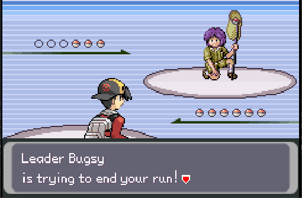
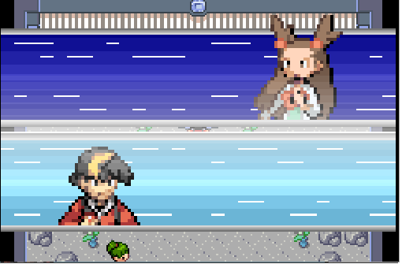
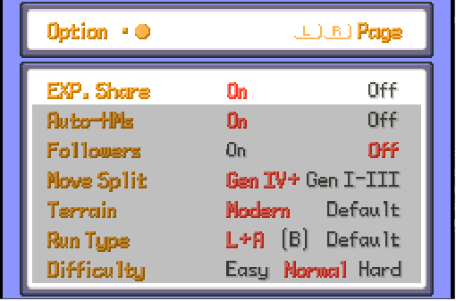

# About `Parody Gen2`, aka "Pokemon Dark Gold" or "Difficult Johto"

I (smithk200) wanted to modify Pokémon HeartGold and SoulSilver, but am unfamiliar with Gen 4 decomp and don't want to make a binary hack of HGSS because *binary sucks*... I mean, binary is prone to crashes and requires a lot of tools to modify a ton of parameters. Plus, I want to make a challenge hack based around Johto that had features from later Pokémon games, such as Gen 6 EXP share (because grinding for EXP is no fun). Also, I wanted to add some other features to this game but simply do not have the time.

DISCLAIMER: This is not an official port of Pokémon Heart and Soul to pokeemerald-expansion; this is a fan-based project. This is not the 2.0 update, but if you don't want to wait for the official 2.0 update then this might be a good fit for you.

This is my own mod of the game and it's meant to have more mature humor. Also it's more difficult than the original game.


## LIST OF FEATURES:

Implemented

- Music choices from Johto, Sinnoh, and Hoenn.
- Generation 6 EXP Share from the menu.
- Ability to toggle between the backgrounds used for HnS or the default ones from Hoenn.
- Auto-HMs from Pokémon Clover, where you don't need a prompt in order to use a field move.
- Battle Frontier! (After defeating Red, you gain the option of traveling to the Battle Frontier. You can leave from either Olivine or Vermilion. However, leaving the Battle Frontier takes you to Vermilion.)
- Bug catching contest (albeit with a few bugs)
- Nuzlocke and challenge modes from the original HnS have been implemented! The only challenges that aren't in play are the One Type Challenge, the Pokecenter challenge, and any challenge that was on the last menu.
- Also, VS Seeker functionality has been implemented.

Note: this uses 95.7% of ROM space, last I checked.



## CREDITS
- HnS Dev Team for their amazing work!
- RHH and pokeemerald expansion dev team, of course!
- NecroDingo- Nuzlocke mode (initial codebase)
- Jaizu- FireRed style NPCs


  

<!-- If you want to re-record or change these gifs, here are some notes that I used: https://files.catbox.moe/05001g.md -->

This is based off pokeemerald-expansion, which is documented below.

**`pokeemerald-expansion`** is a GBA ROM hack base that equips developers with a comprehensive toolkit for creating Pokémon ROM hacks. **`pokeemerald-expansion`** is built on top of [pret's `pokeemerald`](https://github.com/pret/pokeemerald) decompilation project. **It is not a playable Pokémon game on its own.** 

# [Features](FEATURES.md)

**`pokeemerald-expansion`** offers hundreds of features from various [core series Pokémon games](https://bulbapedia.bulbagarden.net/wiki/Core_series), along with popular quality-of-life enhancements designed to streamline development and improve the player experience. A full list of those features can be found in [`FEATURES.md`](FEATURES.md).

# [Credits](CREDITS.md)

 [](CREDITS.md)

If you use **`pokeemerald-expansion`**, please credit **RHH (Rom Hacking Hideout)**. Optionally, include the version number for clarity.
Also please credit the makers of Pokémon Heart and Soul because their assets are used too!
https://github.com/PokemonHnS-Development/pokemonHnS

```
Based off RHH's pokeemerald-expansion 1.13.3 https://github.com/rh-hideout/pokeemerald-expansion/
```

Please consider [crediting all contributors](CREDITS.md) involved in the project!

# Choosing `pokeemerald` or **`pokeemerald-expansion`**

- **`pokeemerald-expansion`** supports multiplayer functionality with other games built on **`pokeemerald-expansion`**. It is not compatible with official Pokémon games.
- If compatibility with official games is important, use [`pokeemerald`](https://github.com/pret/pokeemerald). Otherwise, we recommend using **`pokeemerald-expansion`**.
- **`pokeemerald-expansion`** incorporates regular updates from `pokeemerald`, including bug fixes and documentation improvements.

# [Getting Started](INSTALL.md)

❗❗ **Important**: Do not use GitHub's "Download Zip" option as it will not include commit history. This is necessary if you want to update or merge other feature branches. 

If you're new to git and GitHub, [Team Aqua's Asset Repo](https://github.com/Pawkkie/Team-Aquas-Asset-Repo/) has a [guide to forking and cloning the repository](https://github.com/Pawkkie/Team-Aquas-Asset-Repo/wiki/The-Basics-of-GitHub). Then you can follow one of the following guides:

## 📥 [Installing **`pokeemerald-expansion`**](INSTALL.md)
## 🏗️ [Building **`pokeemerald-expansion`**](INSTALL.md#Building-pokeemerald-expansion)
## 🚚 [Migrating from **`pokeemerald`**](INSTALL.md#Migrating-from-pokeemerald)
## 🚀 [Updating **`pokeemerald-expansion`**](INSTALL.md#Updating-pokeemerald-expansion)

# [Documentation](https://rh-hideout.github.io/pokeemerald-expansion/)

For detailed documentation, visit the [pokeemerald-expansion documentation page](https://rh-hideout.github.io/pokeemerald-expansion/).

# [Contributions](CONTRIBUTING.md)
If you are looking to [report a bug](CONTRIBUTING.md#Bug-Report), [open a pull request](CONTRIBUTING.md#Pull-Requests), or [request a feature](CONTRIBUTING.md#Feature-Request), our [`CONTRIBUTING.md`](CONTRIBUTING.md) has guides for each.

# [Community](https://discord.gg/6CzjAG6GZk)

[](https://discord.gg/6CzjAG6GZk)

Our community uses the [ROM Hacking Hideout (RHH) Discord server](https://discord.gg/6CzjAG6GZk) to communicate and organize. Most of our discussions take place there, and we welcome anybody to join us!
